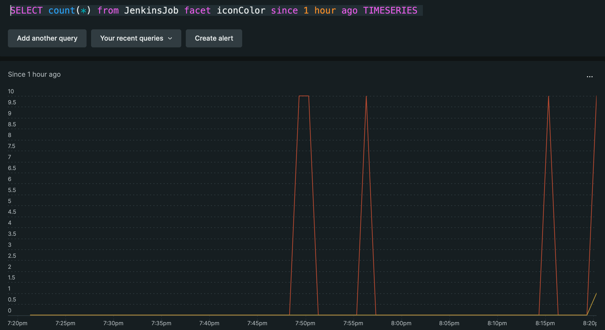
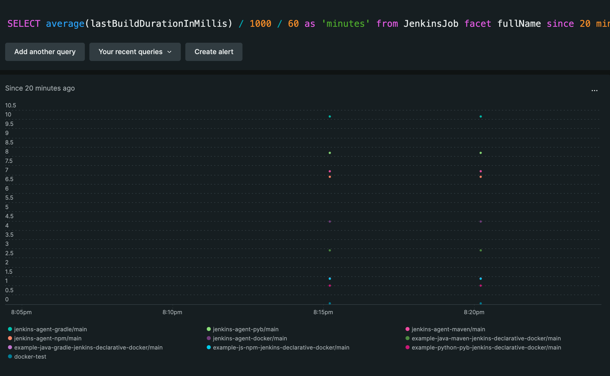
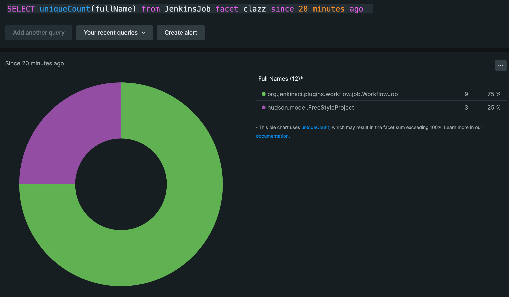
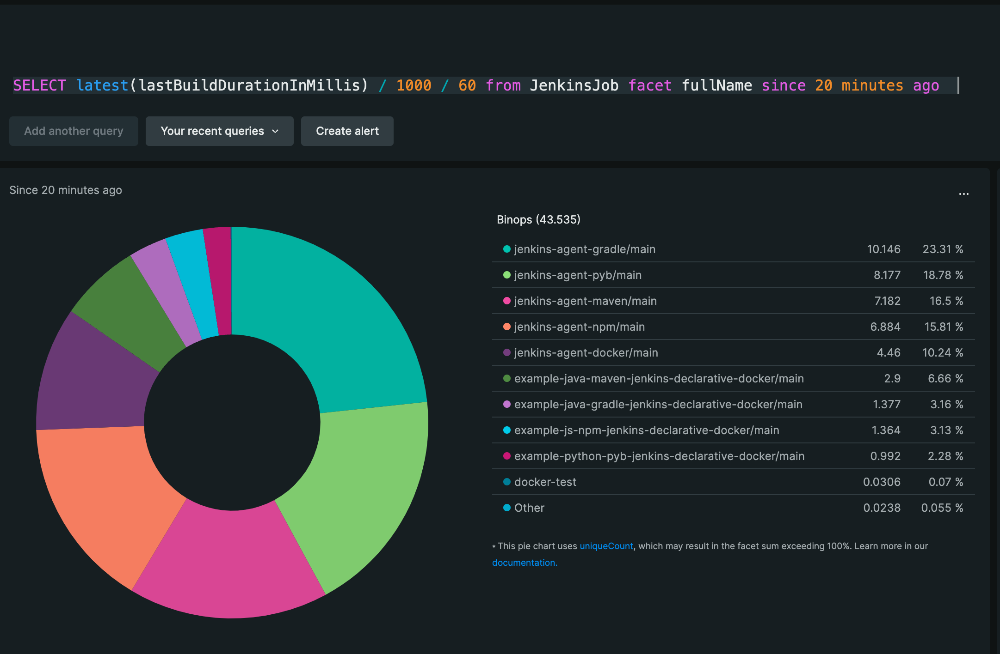
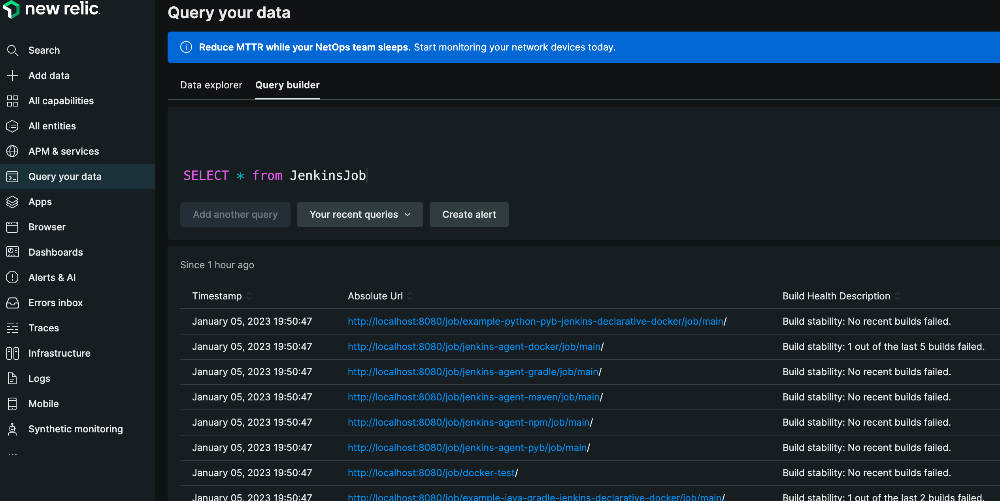

# Groovy-Gradle Jenkins Admin

This application demonstrates how to execute a Groovy script remotely via a Java Application to obtain all job information on a Jenkins instance, and then to post that information to New Relic as a series of events. The reason for doing this is that it gives you a means of monitoring the health of Jenkins at the job level, which is not a current default capability.

# Prerequisites

- A New Relic Account: https://newrelic.com
- The API Key you get when you first create a new Relic account
- The Account ID for your new relic account, which is the the URL when you are logged in
- A Jenkins API Token (See https://github.com/jvalentino/example-jenkins-docker-jcasc-2)

# Running It

You have to use the following command where you pass in your Jenkins username, Jenkins token, New Relic Account ID, and New Relic Token:

```bash
gradle \
  -DJENKINS_USERNAME="admin" \
  -DJENKINS_TOKEN="***" \
  -DJENKINS_URL="http://localhost:8080" \
  -DNEW_RELIC_ACCOUNT_ID="***" \
  -DNEW_RELIC_KEY="***" \
  run --stacktrace
```

# Querying the Data

The purpose of doing this is so that you have a periodic means of knowing the state of Jenkins job.

## Job Status Over Time

```sql
SELECT count(*) from JenkinsJob facet iconColor since 1 hour ago TIMESERIES 
```



## Build Duration Over Time

```sql
SELECT average(lastBuildDurationInMillis) / 1000 / 60 as 'minutes' from JenkinsJob facet fullName since 20 minutes ago TIMESERIES 
```



## Current Job Type Makeup

```sql
SELECT uniqueCount(fullName) from JenkinsJob facet clazz since 20 minutes ago  
```



## Which jobs take the longest to run?

```sql
SELECT latest(lastBuildDurationInMillis) / 1000 / 60 from JenkinsJob facet fullName since 20 minutes ago  
```



# How does this work?

## Remote Script Execution

It starts by executing this Groovy script via the Jenkins REST API, which collected all the jobs with their stats, and outputs them as JSON:

scripts/list-jobs.groovy

```groovy
import groovy.json.JsonBuilder

List jobs = [];
Jenkins.instance.getAllItems(Job.class).each {
    def buildHealth = it.buildHealth
    Map job = [
            fullName: it.fullName,
            absoluteUrl: it.absoluteUrl,
            description: it.description,
            displayName: it.displayName,
            name: it.name,
            clazz: it.class.getName(),
            pronoun: it.pronoun,
            searchName: it.searchName,
            searchUrl: it.searchUrl,
            url: it.url,
            buildHealthDescription: buildHealth.description,
            buildIcon: buildHealth.iconClassName,
            buildScore: buildHealth.score,
            iconColor: it.iconColor.toString(),
            working: it.iconColor.toString().startsWith('blue') ? 1 : 0,
    ]
    jobs.add(job)
}

println new JsonBuilder(jobs).toString()
```

## Storing the Job Output

The result of the jenkins scirpt executing is then stored locally in memory, and also output to the file system for easier debugging in pretty format:

build/list-jobs.groovy

```json
[
    {
        "fullName": "docker-test",
        "absoluteUrl": "http://localhost:8080/job/docker-test/",
        "description": "",
        "displayName": "docker-test",
        "name": "docker-test",
        "clazz": "hudson.model.FreeStyleProject",
        "pronoun": "Project",
        "searchName": "docker-test",
        "searchUrl": "job/docker-test/",
        "url": "job/docker-test/",
        "buildHealthDescription": "Build stability: No recent builds failed.",
        "buildIcon": "icon-health-80plus",
        "buildScore": 100,
        "iconColor": "blue",
        "working": 1,
        "lastBuildTime": "2023-01-03T14:00:33+0000",
        "lastBuildDurationInMillis": 1834
    },
    {
        "fullName": "example-java-gradle-jenkins-declarative-docker/main",
        "absoluteUrl": "http://localhost:8080/job/example-java-gradle-jenkins-declarative-docker/job/main/",
        "description": null,
        "displayName": "main",
        "name": "main",
        "clazz": "org.jenkinsci.plugins.workflow.job.WorkflowJob",
        "pronoun": "Pipeline",
        "searchName": "main",
        "searchUrl": "job/main/",
        "url": "job/example-java-gradle-jenkins-declarative-docker/job/main/",
        "buildHealthDescription": "Build stability: 1 out of the last 2 builds failed.",
        "buildIcon": "icon-health-40to59",
        "buildScore": 50,
        "iconColor": "blue",
        "working": 1,
        "lastBuildTime": "2023-01-04T22:59:25+0000",
        "lastBuildDurationInMillis": 82648
    },
    {
        "fullName": "example-java-maven-jenkins-declarative-docker/main",
        "absoluteUrl": "http://localhost:8080/job/example-java-maven-jenkins-declarative-docker/job/main/",
        "description": null,
        "displayName": "main",
        "name": "main",
        "clazz": "org.jenkinsci.plugins.workflow.job.WorkflowJob",
        "pronoun": "Pipeline",
        "searchName": "main",
        "searchUrl": "job/main/",
        "url": "job/example-java-maven-jenkins-declarative-docker/job/main/",
        "buildHealthDescription": "Test Result: 0 tests failing out of a total of 2 tests.",
        "buildIcon": "icon-health-80plus",
        "buildScore": 100,
        "iconColor": "blue",
        "working": 1,
        "lastBuildTime": "2023-01-04T23:06:27+0000",
        "lastBuildDurationInMillis": 173975
    },
    {
        "fullName": "example-js-npm-jenkins-declarative-docker/main",
        "absoluteUrl": "http://localhost:8080/job/example-js-npm-jenkins-declarative-docker/job/main/",
        "description": null,
        "displayName": "main",
        "name": "main",
        "clazz": "org.jenkinsci.plugins.workflow.job.WorkflowJob",
        "pronoun": "Pipeline",
        "searchName": "main",
        "searchUrl": "job/main/",
        "url": "job/example-js-npm-jenkins-declarative-docker/job/main/",
        "buildHealthDescription": "Build stability: No recent builds failed.",
        "buildIcon": "icon-health-80plus",
        "buildScore": 100,
        "iconColor": "blue",
        "working": 1,
        "lastBuildTime": "2023-01-04T23:15:18+0000",
        "lastBuildDurationInMillis": 81826
    },
    {
        "fullName": "example-python-pyb-jenkins-declarative-docker/main",
        "absoluteUrl": "http://localhost:8080/job/example-python-pyb-jenkins-declarative-docker/job/main/",
        "description": null,
        "displayName": "main",
        "name": "main",
        "clazz": "org.jenkinsci.plugins.workflow.job.WorkflowJob",
        "pronoun": "Pipeline",
        "searchName": "main",
        "searchUrl": "job/main/",
        "url": "job/example-python-pyb-jenkins-declarative-docker/job/main/",
        "buildHealthDescription": "Build stability: No recent builds failed.",
        "buildIcon": "icon-health-80plus",
        "buildScore": 100,
        "iconColor": "blue",
        "working": 1,
        "lastBuildTime": "2023-01-04T23:20:53+0000",
        "lastBuildDurationInMillis": 59528
    },
    {
        "fullName": "jenkins-agent-docker/main",
        "absoluteUrl": "http://localhost:8080/job/jenkins-agent-docker/job/main/",
        "description": null,
        "displayName": "main",
        "name": "main",
        "clazz": "org.jenkinsci.plugins.workflow.job.WorkflowJob",
        "pronoun": "Pipeline",
        "searchName": "main",
        "searchUrl": "job/main/",
        "url": "job/jenkins-agent-docker/job/main/",
        "buildHealthDescription": "Build stability: 1 out of the last 5 builds failed.",
        "buildIcon": "icon-health-60to79",
        "buildScore": 80,
        "iconColor": "blue",
        "working": 1,
        "lastBuildTime": "2023-01-02T18:15:04+0000",
        "lastBuildDurationInMillis": 267594
    },
    {
        "fullName": "jenkins-agent-gradle/main",
        "absoluteUrl": "http://localhost:8080/job/jenkins-agent-gradle/job/main/",
        "description": null,
        "displayName": "main",
        "name": "main",
        "clazz": "org.jenkinsci.plugins.workflow.job.WorkflowJob",
        "pronoun": "Pipeline",
        "searchName": "main",
        "searchUrl": "job/main/",
        "url": "job/jenkins-agent-gradle/job/main/",
        "buildHealthDescription": "Build stability: No recent builds failed.",
        "buildIcon": "icon-health-80plus",
        "buildScore": 100,
        "iconColor": "blue",
        "working": 1,
        "lastBuildTime": "2023-01-03T22:07:16+0000",
        "lastBuildDurationInMillis": 608754
    },
    {
        "fullName": "jenkins-agent-maven/main",
        "absoluteUrl": "http://localhost:8080/job/jenkins-agent-maven/job/main/",
        "description": null,
        "displayName": "main",
        "name": "main",
        "clazz": "org.jenkinsci.plugins.workflow.job.WorkflowJob",
        "pronoun": "Pipeline",
        "searchName": "main",
        "searchUrl": "job/main/",
        "url": "job/jenkins-agent-maven/job/main/",
        "buildHealthDescription": "Build stability: No recent builds failed.",
        "buildIcon": "icon-health-80plus",
        "buildScore": 100,
        "iconColor": "blue",
        "working": 1,
        "lastBuildTime": "2023-01-03T21:53:49+0000",
        "lastBuildDurationInMillis": 430896
    },
    {
        "fullName": "jenkins-agent-npm/main",
        "absoluteUrl": "http://localhost:8080/job/jenkins-agent-npm/job/main/",
        "description": null,
        "displayName": "main",
        "name": "main",
        "clazz": "org.jenkinsci.plugins.workflow.job.WorkflowJob",
        "pronoun": "Pipeline",
        "searchName": "main",
        "searchUrl": "job/main/",
        "url": "job/jenkins-agent-npm/job/main/",
        "buildHealthDescription": "Build stability: No recent builds failed.",
        "buildIcon": "icon-health-80plus",
        "buildScore": 100,
        "iconColor": "blue",
        "working": 1,
        "lastBuildTime": "2023-01-04T22:31:32+0000",
        "lastBuildDurationInMillis": 413017
    },
    {
        "fullName": "jenkins-agent-pyb/main",
        "absoluteUrl": "http://localhost:8080/job/jenkins-agent-pyb/job/main/",
        "description": null,
        "displayName": "main",
        "name": "main",
        "clazz": "org.jenkinsci.plugins.workflow.job.WorkflowJob",
        "pronoun": "Pipeline",
        "searchName": "main",
        "searchUrl": "job/main/",
        "url": "job/jenkins-agent-pyb/job/main/",
        "buildHealthDescription": "Build stability: No recent builds failed.",
        "buildIcon": "icon-health-80plus",
        "buildScore": 100,
        "iconColor": "blue",
        "working": 1,
        "lastBuildTime": "2023-01-04T22:30:32+0000",
        "lastBuildDurationInMillis": 490596
    }
]
```

## Submitting to New Relic

Then the eventType of "JenkinsJob" is added to each above record, and submitting to new relic as a custom event.

You can see the results from the QueryBuilder:




# FAQ

## How did I generate this project?

```bash
$ gradle init
Starting a Gradle Daemon (subsequent builds will be faster)

Select type of project to generate:
  1: basic
  2: application
  3: library
  4: Gradle plugin
Enter selection (default: basic) [1..4] 2

Select implementation language:
  1: C++
  2: Groovy
  3: Java
  4: Kotlin
  5: Scala
  6: Swift
Enter selection (default: Java) [1..6] 2

Split functionality across multiple subprojects?:
  1: no - only one application project
  2: yes - application and library projects
Enter selection (default: no - only one application project) [1..2] 1

Select build script DSL:
  1: Groovy
  2: Kotlin
Enter selection (default: Groovy) [1..2] 1

Generate build using new APIs and behavior (some features may change in the next minor relea
Project name (default: groovy-gradle-jenkins-admin): 
Source package (default: groovy.gradle.jenkins.admin): com.github.jvalentino.jenkins

> Task :init
Get more help with your project: https://docs.gradle.org/7.6/samples/sample_building_groovy_applications.html

BUILD SUCCESSFUL in 43s
```

## How does New Relic Integration work?

As soon as you create an account on https://newrelic.com, you are given an API Token and your account ID is the URL after you login. You can then use this API token to create a custom event like so:

```bash
curl --location --request POST 'https://insights-collector.newrelic.com/v1/accounts/YOUR_ACCOUNT_ID/events' \
--header 'Content-Type: application/json' \
--header 'X-Insert-Key: YOUR_TOKEN' \
--data-raw '[
   {
      "eventType":"CustomEventTest",
      "account":3,
      "amount":259.54
   }
]'
```

View "Query your data", you can then see this event:


